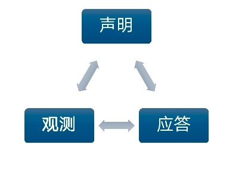

# operator 入门

本文档阅读人群是有一定的容器以及在云原生领域有所实践的人群.


本次将分多个篇章讲述基于operator-sdk这个go框架，开发operator最佳实践。

会同步将文档和代码同步到[github](https://github.com/shenkonghui/operator-sdk-best-practices)上面


   * [operator 入门](#operator-入门)
      
      * [operator是什么](#operator是什么)
      
      * [声明式API是什么？](#声明式api是什么)
      
      * [operator与controller的区别](#operator与controller的区别)
      
      * [几种常见的operator/controller开发框架](#几种常见的operatorcontroller开发框架)
      
      * [k8s 开发库](#k8s-开发库)
      
      * [operatorhub.io](#operatorhubio)
      
        

## operator是什么

operator是kubernets的一种扩展方式，

Operator 模式旨在捕获（正在管理一个或一组服务的）运维人员的关键目标。 负责特定应用和 service 的运维人员，在系统应该如何运行、如何部署以及出现问题时如何处理等方面有深入的了解。

可以见官方文档

https://kubernetes.io/zh/docs/concepts/extend-kubernetes/operator/


## 声明式API是什么？

在讲operator之前先说明一下声明式API，这是云原生非常重要的一个概念。相对于传统的命令式API，在云的领域，声明式API有着很多优势。

整个操作流程包括三个流程。

1. 声明

   使用声明式API指定资源的最终状态。如果熟悉k8s，也就是一个yaml编排文件

2. 观测

   kubernetes中每一个资源都会存在一个管理它的控制器，控制器监听着所有资源的状态，一旦监听到发生变化就会触发某个动作，比如创建pod，探针失效等等

3. 应答
    然后就是最重要的一步了，监听到动作以后，就需要保证将状态变成你所期望的状态。在这一步可以实现复杂的运维工作，比如保证将副本个数维持在一定的比例这么一个简单的动作；也可以实现一个mysql集群的主备切换。





## operator与controller的区别

上面已经说到了控制器(controller)，本次的主题是operator，那么operator和controller又有什么区别呢。

这里就详细说明一下。


controller 是 k8s中维护资源对象的程序，会根据编排文件yaml维护资源对象，以达到期望的状态，如deployment controller，job controller等。当然也可以自定义实现controller。


operator 其实属于controller的一种，但是更加专业。

开发人员扩展K8s往往需要开发crd(自定义资源) 和 controller 来运维特定的程序(一般都是中间件)。用一个公式表示就就是 operator = crd + controller + 中间件运维。


比如etcd-operator、mysql-operator、istio-operator。使用者往往需要创建一个名为operator的控制器 、然后定义一个crd，然后operator就会创建中间件到你期望的状态。之后也再也不需要运维人员了(理想条件下)，因为operator能实现全部自动化的运维工作(副本控制、网络管理等等)，只要你定义一个你期望的状态(yaml)。


## 几种常见的operator/controller开发框架


- [sample-controller](https://github.com/kubernetes/sample-controller)

  在k8s官方仓库中，提供了简单的controller实现

- [kubebuilder](https://github.com/kubernetes-sigs/kubebuilder)

  kubernetes-sigs 是k8s SIG组织推出的开发框架

- [operator-sdk](https://github.com/operator-framework/operator-sdk)

  operator-sdk是coreos开源的框架，在github上也是star最高的, 可以直接尝试使用这个框架进行开发operator


## k8s 开发库

- [client-go](https://github.com/kubernetes/client-go)

  是k8s 的golang库，RESTClient、DynamicClient、ClientSet都是在client-go里面

  

- RESTClient
  RESTClient是最基础的，相当于的底层基础结构，可以直接通过 是RESTClient提供的RESTful方法如Get()，Put()，Post()，Delete()进行交互. 可以实现任意资源的操作

  关键代码

  ```
  import "k8s.io/client-go/rest"
  
  pod := v1.Pod{}
  restClient, err := rest.RESTClientFor(config)
  err = restClient.Get().Resource("pods").Namespace("default").Name("nginx-1487191267-b4w5j").Do().Into(&pod)
  ```

- DynamicClient
  DynamicClient是对RESTClient的封装，支持动态设置访问类型

  关键代码

  ```
  import "k8s.io/client-go/dynamic"
  resource := &unversioned.APIResource{Name: "pods", Namespaced: true}
  obj, err := dynamicClient.Resource(resource, "").List(&v1.ListOptions{})
  ```

  
  
- ClientSet
    ClientSet也是对RESTClient的一种封装，与DynamicClient不同的是，ClientSet支持衍生出具体资源的Client，如PodClient等。ClientSet是Kubernetes用的最多的Client类型. 优雅的姿势是利用一个controller对象，再加上Informe
    
    关键代码
    
    ```
    import "k8s.io/client-go/kubernetes"
    clientset, err := kubernetes.NewForConfig(config)
    podClient := clientset.Core().Pods("")
    pods, err := podClient.List(apiv1.ListOptions{})
    ```
    
    

这里就不详细说明了, operator-sdk主要封装了DynamicClient来访问kubernetes

以下是框架的关键代码

```
main.go
mgr, err := manager.New(cfg, options)

manager.go
apiReader, err := client.New(config, client.Options{Scheme: options.Scheme, Mapper: mapper})
	
client.go
dynamicClient, err := dynamic.NewForConfig(config)
```


## operatorhub.io

和helm chart一样，operator也拥有一个开源社区，管理社区开发的operator。


使用operatorhub之前，你需要安装OLM(operator 生命周期管理)，如果是helm相当于同步operatorhub的operator包到你的本地，也可以上传自己的operator包，然后就可以愉快的安装operator了。


