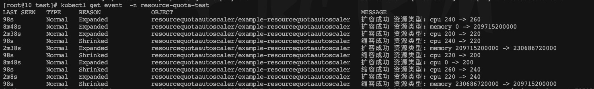

# 事件管理

这是说的事件不是监听集群的事件，而是控制器自身创建事件

在控制器我们经常需要输出信息给外部，可以是日志，又或者是直接放在到statue中，这里我们将通过事件的方式输出控制器的操作状态。


```
 ~/src/github  kubectl get event
LAST SEEN   TYPE     REASON              OBJECT                                   MESSAGE
<unknown>   Normal   Scheduled           pod/nginx-deployment-79797766b7-qqwbw    Successfully assigned resource-quota-test/nginx-deployment-79797766b7-qqwbw to host-78
35m         Normal   Pulled              pod/nginx-deployment-79797766b7-qqwbw    Container image "nginx:1.14.2" already present on machine
35m         Normal   Created             pod/nginx-deployment-79797766b7-qqwbw    Created container nginx
35m         Normal   Started             pod/nginx-deployment-79797766b7-qqwbw    Started container nginx
36m         Normal   SuccessfulCreate    replicaset/nginx-deployment-79797766b7   Created pod: nginx-deployment-79797766b7-qqwbw
36m         Normal   ScalingReplicaSet   deployment/nginx-deployment              Scaled up replica set nginx-deployment-79797766b7 to 1
```


通过kubectl get event 可以看到，event输出基本上有这么几个属性。

- LAST SEEN

  输出的时间

- TYPE

  类型，为字符串，Normal、Warn等

- REASON

  原因，输出事件的原因

- OBJECT

  事件的资源对象，命名为“<resourceType>/<resourceName>”

- MESSAGE

  事件信息


## 代码实现

```
func CreateEvent(client client.Client, meta metav1.ObjectMeta, typemeta metav1.TypeMeta,
	LastTimestamp time.Time, t string, message string, reason string, ) error {
	event := newEvent(meta)
	event.LastTimestamp = metav1.Time{LastTimestamp}
	event.Type = t
	event.InvolvedObject = corev1.ObjectReference{
		Kind:      typemeta.Kind,
		Name:      meta.Name,
		Namespace: meta.Namespace,
		UID:       meta.UID,
	}
	event.Message = message
	event.Reason = reason
	return client.Create(context.TODO(), event)
}

func newEvent(meta metav1.ObjectMeta) *corev1.Event {
	event := &corev1.Event{}
	event.ObjectMeta.GenerateName = fmt.Sprintf("%s-", meta.Name)
	event.ObjectMeta.Labels = meta.Labels
	event.ObjectMeta.Namespace = meta.Namespace
	return event
}
```


然后调用

```
		err = util.CreateEvent(r.client, rqa.ObjectMeta, rqa.TypeMeta,util.ConverToTime(rqa.Status.LastExpandTimeScale),
			"Normal",fmt.Sprintf("扩容成功 资源类型: %s %d -> %d",
				resourceName, status.ResourceQuotaHard.MilliValue(), nowHard.MilliValue()),"Expanded")
```

最后的效果

