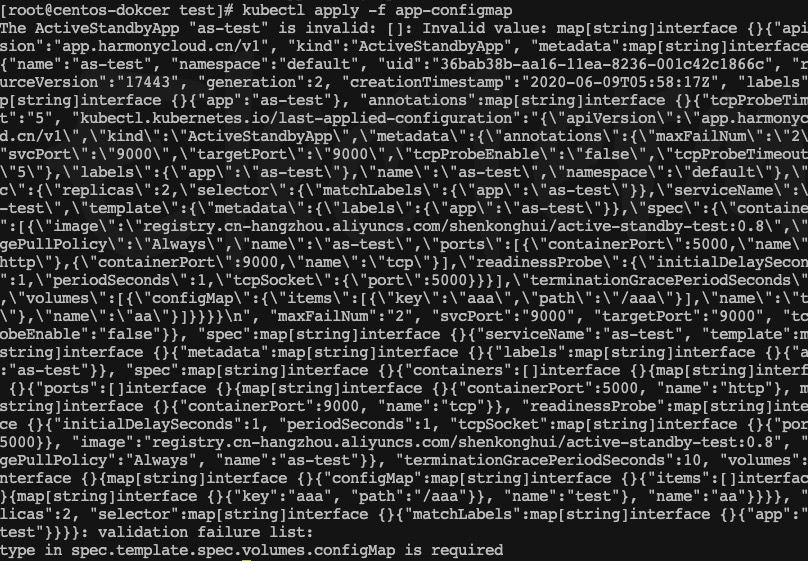

# 常见异常和问题

## 空指针异常

assignment to entry in nil map

像下面取map的时候需要先确保rqa.Spec.Resource不是nil

```
if !reflect.ValueOf(rqa.Spec.Resource).IsNil(){
  	rqa.Spec.Resource[resourceName]
}
```


## 创建cr失败

提示:type in spec.template.spec.volumes.configMap is required.
1.17/1.18测试没有这个问题
1.12/1.13测试存在这个问题




解决方法

低版本的k8s(只验证过1.17\1.18没有该问题、1.12、1.13有该问题) crd字段中如果带items，那么就需要带type: array
https://github.com/kubernetes/kubernetes/issues/68466


## 创建crd的时候apiservice报err

```
ERROR $root.definitions.cn.harmonycloud.app.v1.ActiveStandbyApp.properties.spec.properties.template.properties.spec.properties.initContainers.items.<array>.properties.startupProbe.properties.tcpSocket.properties.port has invalid property: anyOf
```

新版本的问题，无法识别anyOf类型，暂时无解。只有在创建crd的时候才会出现一次，功能无影响。也可以在crd中将这一段去掉


## 无法循环import包

```
import cycle not allowed
```

原因在于我外部包引用了控制器包，控制器包又引用了外部包。建议将所有自定义方法都存在在pkg下面的自定义包，控制器就尽量不要被引用。


## 如何保证验证字段的完整性